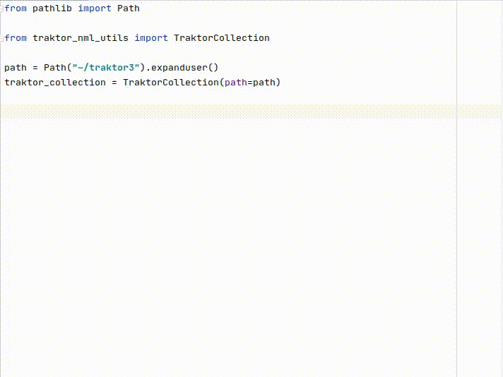

# Traktor NML utils

[](https://travis-ci.com/wolkenarchitekt/traktor-nml-utils)

This module contains utilities to parse and modify [Native Instruments Traktor](https://www.native-instruments.com/de/products/traktor/dj-software/traktor-pro-3/) NML files.\
Both Traktor 2.x and Traktor 3.x NML files are supported.

It can parse collection NML files (`$TRAKTOR_DIR/collection.nml`) and history NML files (`$TRAKTOR_DIR/History/history_$DATE.nml`).

All NML attributes are readable and writable using auto-generated dataclasses 
(see `traktor_nml_utils/models`).\
This allows a typesafe way to work with NML files, fully supporting IDE autocompletion:



While reading should work in 99% cases, writing NML files hasn't been tested thoroughly enough yet, so always 
keep a copy of your NML files.

## Requirements

Because traktor-nml-utils uses `dataclasses`, you need at least Python 3.7.x.

traktor-nml-utils is tested with Traktor 3.3.0, though it should be able to parse
Traktor 2.x NML files as well. Feel free to provide files that cause problems on parsing.  

## Installation

```shell
pip install traktor-nml-utils
```

## Usage

### Get artist, title and rating of all collection entries

```python
from traktor_nml_utils import TraktorCollection
from pathlib import Path

collection = TraktorCollection(path=Path('collection.nml'))

for entry in collection.nml.entry:
    print(entry.artist, entry.title, entry.info.ranking)
```

### Get cuepoint start

```python
entry = collection.nml.entry[0]

for cue_v2 in entry.cue_v2:
    print(cue_v2.start)
```

### Find entry

```python
artist = "Yotto"
title = "Another Riff For The Good Times (Extended Mix)"

entry = [
    entry for entry in collection.nml.entry 
    if entry.artist == artist
    and entry.title == title
][0]
```

### Add cuepoint

```python
from traktor_nml_utils.models.collection import CueV2Type
from traktor_nml_utils.utils import duration_str_to_milliseconds

my_cue = CueV2Type(
    value=None, 
    name='n.n.', 
    displ_order=0, 
    type=0, 
    start=duration_str_to_milliseconds("00:01:00"), 
    len=0.0, 
    repeats=-1, 
    hotcue=1
)
entry.cue_v2.append(my_cue)

# Write XML file
collection.save()
```

## Run tests

Run tests within Docker container:

```shell
make docker-build docker-test
```

Create virtualenv and run tests:

```shell
make virtualenv-create virtualenv-test
```


To test if parsing your own collection/history files with traktor-nml-utils works, 
pass your Traktor directory to pytest:

```shell
pytest --nml-dir="~/traktor3/" tests/test_parser.py::test_parse_nml_files
```  

## How does it work?

### NML file to XSD schema 

Since there is no official XSD available to parse Traktor NML files, an XSD was generated
both for history and collection files using [Apache XMLBeans](https://xmlbeans.apache.org/).

See them in `xml_to_xsd/collection.xsd` and `xml_to_xsd/history.xsd`.

You can regenerate the XSD by putting your own `collection.nml` and `history.nml` overwriting
 the existing ones in `./xml_to_xsd/` and run:
```shell
make xml-to-xsd
```
 
### XSD to Python dataclasses

Using the generated XSD files, Python dataclasses can be generated with [xsdata](https://pypi.org/project/xsdata/).
To update these, run:

```shell
make xsd-to-python
```
 
## Contribution

### Help wanted!
Since the XSD-schema was created from my own Traktor files, the schema might 
not fit for all collection and history files.
In case you have any problems parsing NML files, please report an issue and 
attach the problematic NML file so I can update the schema.
